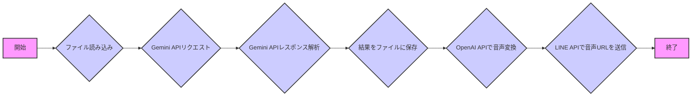
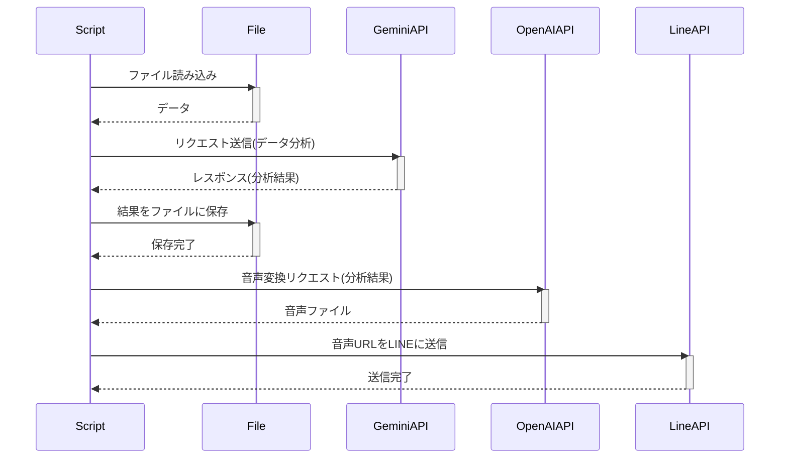
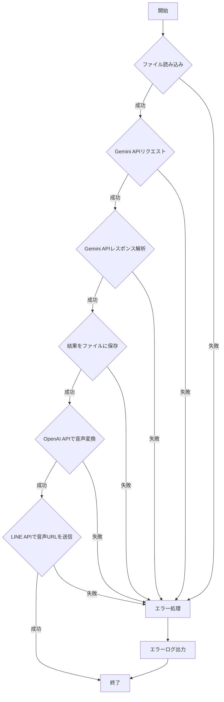

# main.py

## 1. 概略

このPythonスクリプトは、指定されたファイルから時系列データを読み込み、GoogleのGemini APIを使用してデータを分析し、結果をログファイルに保存します。さらに、OpenAI APIを使用して分析結果を音声に変換し、生成された音声ファイルのURLをLINE Messaging APIを通じて特定のLINEチャンネルに送信します。

主な機能は以下のとおりです。

*   ファイルから時系列データの読み込み
*   Gemini APIへのリクエスト送信とレスポンスの解析
*   分析結果のログファイルへの保存
*   OpenAI APIによるテキスト音声変換
*   生成された音声ファイルのURLをLINEに送信

## 2. アーキテクチャ図

## 3. シーケンス図

## 4. フローチャート

## 5. 拡張性

*   **APIキー管理:** 現在、APIキーがコードに直接埋め込まれています。環境変数や安全なキー管理システム（例：HashiCorp Vault）を使用するように変更することで、セキュリティを向上させることができます。
*   **設定ファイル:**  `TARGET_FILE`、`LOG_PATH`、`VOICE_PATH`、`VOICE_URL`などの設定をコードから分離し、設定ファイル（JSON, YAMLなど）で管理するように変更することで、柔軟性を高めることができます。
*   **モジュール化:** 各機能（ファイル読み込み、API呼び出し、音声変換、LINE送信）を個別のモジュールに分割することで、コードの再利用性とテスト容易性を向上させることができます。
*   **エラー処理の改善:**  `main`関数内の`try-except`ブロックでエラー発生時の処理を詳細化し、エラーの種類に応じて適切な処理を行うように変更することで、システムの安定性を高めることができます。例えば、APIレート制限エラーが発生した場合は、リトライ処理を追加するなどが考えられます。
*   **非同期処理:**  Gemini API、OpenAI API、LINE APIへのリクエストを非同期処理にすることで、全体の処理時間を短縮することができます。`asyncio`ライブラリを使用することが考えられます。
*   **データ変換処理の追加:** 読み込んだデータに対して、データクリーニングや変換処理を行うことで、Gemini APIの分析精度を向上させることができます。
*   **ログレベルの変更:** `print`文によるログ出力だけでなく、loggingライブラリを導入し、ログレベル(DEBUG, INFO, WARNING, ERROR, CRITICAL)を設定できるようにすることで、デバッグや運用時の情報収集を効率化することができます。
*    **音声変換ロジックの分離**: `get_voice`関数内で、`openai.api_key`を設定していますが、この処理はOpenAIクライアントの初期化時に一度だけ行うのが適切です。音声変換に関するロジックをクラスとして分離し、クライアントの初期化をコンストラクタで行うように変更することで、よりオブジェクト指向な設計にすることができます。また、音声の種類（`voice_type`）を動的に変更できるようにすることで、柔軟性を高めることができます。

## 6. 課題

*   **セキュリティ:**
    *   APIキーがソースコードにハードコードされているため、セキュリティ上のリスクがあります。環境変数や専用のシークレット管理システムを使用する必要があります。
    *   ファイルのパスがハードコードされている箇所があり、ファイル操作に関する脆弱性のリスクがあります。
*   **可読性:**
    *   `main`関数が長くなっているため、可読性が低い可能性があります。関数を分割し、それぞれの責務を明確にすることで可読性を向上させることができます。
    *   エラーメッセージが簡潔すぎるため、問題の特定が難しい場合があります。より詳細なエラーメッセージを出力するように変更する必要があります。
*   **保守性:**
    *   APIエンドポイントやトークンがコードに直接記述されているため、変更時の影響範囲が大きいです。設定ファイルに分離することで、保守性を向上させることができます。
    *   例外処理が一律に`Exception`をキャッチしているため、特定のエラーに対する適切な処理ができません。具体的な例外クラスを指定して、エラーの種類に応じた処理を行うようにする必要があります。
*   **堅牢性:**
    *   APIリクエストが失敗した場合のリトライ処理がないため、一時的なネットワークエラーなどが発生した場合に処理が中断してしまいます。リトライ処理を実装する必要があります。
    *   入力データのバリデーションが行われていないため、不正なデータが入力された場合に予期せぬエラーが発生する可能性があります。入力データのバリデーション処理を追加する必要があります。
*   **テスト容易性:**
    *   外部APIへの依存度が高いため、テストが難しいです。モックオブジェクトを使用するなどして、外部APIへの依存を解消する必要があります。
*   **その他**
    *   `CHANNEL_ACCESS_TOKEN`が2回定義されています。意図しない記述なので修正する必要があります。
    *   `get_file`関数内で例外処理が記述されていないため、ファイルが存在しない場合にエラーが発生し、プログラムが停止する可能性があります。例外処理を追加する必要があります。
    *   ファイル名が`hoge.csv`でハードコードされている箇所があります。本来意図している`TARGET_FILE`を使用するように修正してください。
