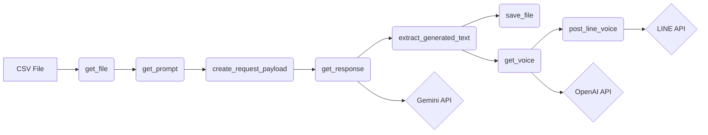
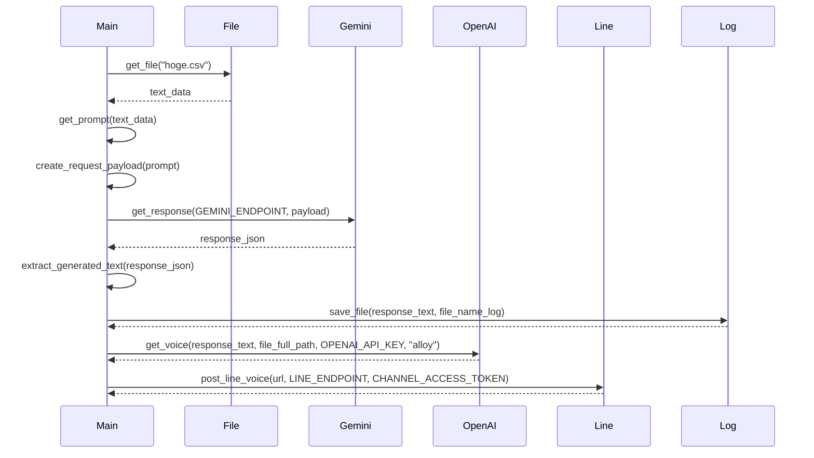

# main.py

## 設計書

### 1. 概略

このPythonスクリプトは、指定されたファイル（CSVを想定）から時系列データを読み込み、Google Gemini APIを使用してそのデータを分析します。分析結果はテキストファイルとして保存され、OpenAI APIを使用して音声ファイルに変換されます。最後に、生成された音声ファイルのURLをLINE Messaging APIを通じてブロードキャストします。

### 2. アーキテクチャ図

### 3. シーケンス図

### 4. フローチャート
不要

### 5. 拡張性

*   **データソースの拡張:** 現在はファイルからのデータ読み込みのみですが、データベースやAPIエンドポイントからデータを取得する機能を追加できます。
*   **分析モデルの拡張:** Gemini APIだけでなく、他のLLMや機械学習モデルを組み込むことで、より多様な分析結果を得られます。設定ファイル等でモデルを選択できるようにすると柔軟性が高まります。
*   **出力形式の拡張:** テキストファイル以外にも、JSON、CSV、HTMLなど、様々な形式で分析結果を保存できるようにします。
*   **通知先の拡張:** LINE以外にも、Slack、Emailなど、複数の通知先に対応できるようにします。
*   **音声合成の拡張:** OpenAI以外にも音声合成APIの選択肢を増やし、声の種類や言語をユーザーが選択できるようにします。
*   **APIキー管理の強化:** APIキーをコードに直接記述するのではなく、環境変数や設定ファイルから読み込むように変更することで、セキュリティを向上させることができます。
*   **エラーハンドリングの改善:** 例外処理を細かく行い、エラー発生時に詳細なログを出力するようにします。
*   **設定ファイルの導入:** APIキー、ファイルパス、モデル名などの設定値を、コードではなく設定ファイル（例：YAML）から読み込むようにすることで、コードの変更なしに設定を変更できます。

### 6. 課題

*   **セキュリティ:**
    *   APIキーがコードにハードコーディングされているため、非常に危険です。環境変数またはセキュアな設定ファイルに移行する必要があります。
    *   TARGET_FILE, VOICE_PATHといったファイルパスが固定されているのも変更されるべきです。
*   **可読性:**
    *   `get_prompt`関数のプロンプトが長いため、可読性が低い可能性があります。プロンプトを外部ファイルに分離するか、より簡潔に記述することを検討します。
    *   エラーメッセージが一部英語、一部日本語で統一されていません。
*   **保守性:**
    *   マジックナンバー（例：`duration: 180000`）がコードに直接記述されているため、意味が分かりにくいです。定数として定義することを推奨します。
    *   LINE Messaging APIのメッセージタイプが`audio`で固定されています。他のメッセージタイプ（テキスト、画像など）にも対応できるように、拡張性を考慮した設計にする必要があります。
*   **エラーハンドリング:**
    *   `main`関数内の`try...except`ブロックが広すぎるため、どこでエラーが発生したか特定しにくい場合があります。より細かく分割し、具体的なエラーメッセージを返すように改善します。
*   **依存関係:**
    *   ライブラリのバージョン管理がされていないため、依存関係が壊れる可能性があります。`requirements.txt`などで依存関係を明示的に管理する必要があります。
*   **ファイルパス:**
    *   `TARGET_FILE = "/path/to/target_file"`がハードコードされているため、汎用性が低いです。コマンドライン引数や設定ファイルから指定できるように変更します。
    *   `LOG_PATH`の計算が冗長です。`os.path.join`を使用すると、よりシンプルに記述できます。
    *   `get_file("hoge.csv")` がハードコードされているため、汎用性が低いです。コマンドライン引数や設定ファイルから指定できるように変更します。
* **その他**
    *  同じトークンが２回定義されている

