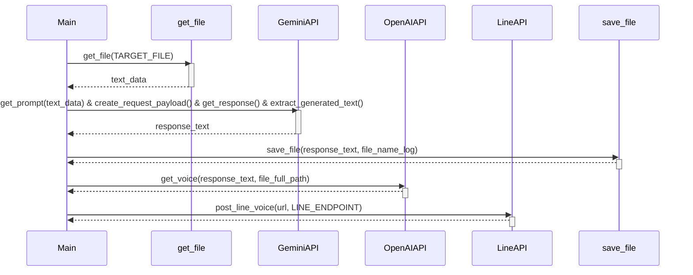
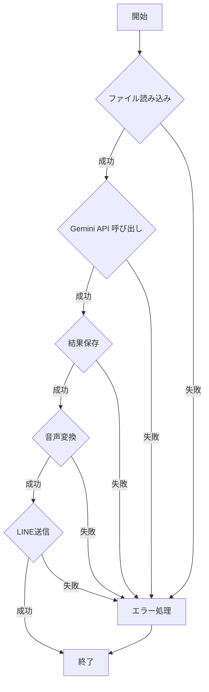

# main.py

## 1. 概略

このPythonスクリプトは、指定された時系列データファイルを読み込み、Gemini APIを使ってデータの分析と解釈を行います。分析結果のテキストをファイルに保存し、OpenAI APIを使ってテキストを音声に変換します。最後に、生成された音声ファイルをLINE Messaging APIを通じてユーザーに送信します。全体として、データ分析、テキスト生成、音声変換、メッセージングという複数の機能を連携させて自動化するパイプラインを構築しています。

## 2. アーキテクチャ図

```mermaid
graph LR
    A[データファイル] --> B(get_file);
    B --> C{Gemini API};
    C -- プロンプト生成 --> D(create_request_payload);
    D --> E(get_response);
    E --> F(extract_generated_text);
    F --> G[分析結果(テキスト)];
    G --> H(save_file);
    G --> I{OpenAI API};
    I -- テキスト --> J(get_voice);
    J --> K[音声ファイル];
    K --> L{LINE Messaging API};
    L -- 音声URL --> M(post_line_voice);
    M --> N[LINEにメッセージ送信];
```

## 3. シーケンス図



## 4. フローチャート



## 5. 拡張性

*   **APIの抽象化:** Gemini API, OpenAI API, LINE APIへの依存を抽象化し、インターフェースを定義することで、将来的に他のAPIプロバイダーに容易に切り替えられるように設計できます。例えば、`TextAnalyzer`, `TextToSpeechConverter`, `MessageSender`のような抽象クラスを作成し、それぞれのAPIに対応した具象クラスを実装します。
*   **設定ファイルの利用:** APIキー、ファイルパス、モデル名などの設定値をコードにハードコーディングするのではなく、設定ファイル（例：YAML, JSON）から読み込むように変更することで、環境に合わせた設定が容易になります。
*   **ログ出力の改善:** より詳細なログを出力できるようにします。例えば、ロギングライブラリ（`logging`モジュール）を使用し、ログレベル（DEBUG, INFO, WARNING, ERROR, CRITICAL）を設定できるようにします。
*   **エラー処理の改善:** 現在のエラー処理は例外をキャッチしてメッセージを表示するだけですが、より詳細なエラー情報（スタックトレースなど）をログに出力し、必要に応じてリトライ処理を行うように改善できます。
*   **並列処理の導入:** データ分析、音声変換、メッセージ送信などの処理を並列化することで、処理時間を短縮できます。`concurrent.futures`モジュールを使用すると、簡単に並列処理を実装できます。
*   **データ検証の強化:** 読み込むデータの形式や内容を検証することで、不正なデータによるエラーを防ぐことができます。`pydantic`ライブラリを使用すると、データモデルを定義し、データの検証を簡単に行うことができます。
*   **メッセージング機能の拡張:** LINEだけでなく、他のメッセージングプラットフォーム（例：Slack, Discord）にも対応できるように、メッセージ送信機能を拡張できます。

## 6. 課題

*   **セキュリティ:**
    *   APIキーがコードにハードコーディングされているため、ソースコードが漏洩した場合に悪用される可能性があります。環境変数やシークレット管理ツールを使用し、APIキーを安全に管理する必要があります。
    *   LINEのチャンネルアクセストークンも同様に、安全な場所に保管する必要があります。
*   **可読性:**
    *   `main`関数が長いため、処理の流れを理解しにくいです。各機能を小さな関数に分割し、モジュール化することで可読性を向上させることができます。
    *   マジックナンバー(例: `duration: 180000`) が使用されているため、数値の意味がわかりにくいです。定数として定義することで、可読性を向上させることができます。
*   **保守性:**
    *   処理が`try-except`ブロックで囲まれているものの、エラー発生時の詳細な情報がログに出力されないため、デバッグが困難になる可能性があります。ログ出力の改善が必要です。
    *   各機能が密結合になっているため、一部の機能を変更した場合に他の機能に影響を与える可能性があります。APIの抽象化やモジュール化により、疎結合な設計にすることで保守性を向上させることができます。
*   **脆弱性:**
    *   `TARGET_FILE` が外部から制御可能な場合、パス操作の脆弱性が発生する可能性があります。入力値の検証や、固定パスを使用するように修正する必要があります。
*   **その他:**
    *   `TARGET_FILE = "/path/to/target_file"` は、実際に存在するファイルパスに置き換える必要があります。
    *   `hoge.csv`へのパスも同様に、正しいパスに修正する必要があります。
    *   Gemini API, OpenAI API, LINE API のAPIキーとトークンがプレースホルダーのままです。正しい値を設定する必要があります。
