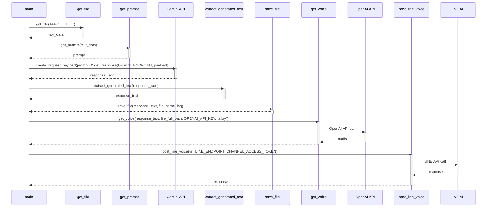

# main.py

## 1. 概略

このPythonスクリプトは、指定されたファイルの時系列データを読み込み、Google Gemini APIを用いてデータ分析を行い、その結果をログファイルに保存し、さらにOpenAI APIで音声に変換し、LINE Notifyを通じて音声ファイルを通知する一連の処理を自動化するものです。

具体的には、以下の手順で動作します。

1.  **データ取得:**  `TARGET_FILE` から時系列データを読み込みます。
2.  **プロンプト作成:**  読み込んだデータに基づいて、Gemini APIに渡すためのプロンプトを生成します。このプロンプトには、データ分析の指示と人格（エンジニアのシキ）が含まれています。
3.  **Gemini API呼び出し:**  生成されたプロンプトをGemini APIに送信し、データ分析結果を取得します。
4.  **結果保存:**  Gemini APIからの応答（分析結果）をログファイルに保存します。
5.  **音声変換:**  分析結果のテキストをOpenAI APIを用いて音声ファイルに変換します。
6.  **LINE通知:**  生成された音声ファイルのURLをLINE Notifyに送信し、通知します。

## 2. アーキテクチャ図

```mermaid
graph LR
    A[ローカルファイル(時系列データ)] --> B(get_file)
    B --> C{プロンプト作成(get_prompt)}
    C --> D[Google Gemini API]
    D --> E{テキストデータ}
    E --> F(extract_generated_text)
    F --> G{ログファイル保存(save_file)}
    F --> H{音声ファイル作成(get_voice)}
    H --> I[OpenAI API]
    I --> J{音声ファイル保存}
    J --> K{LINE通知(post_line_voice)}
    K --> L[LINE API]
```

## 3. シーケンス図



## 4. フローチャート

```mermaid
graph TD
    A[Start] --> B{ファイル読み込み (get_file)};
    B --> C{プロンプト作成 (get_prompt)};
    C --> D{Gemini API呼び出し (get_response)};
    D --> E{テキスト抽出 (extract_generated_text)};
    E --> F{ログファイル保存 (save_file)};
    F --> G{音声変換 (get_voice)};
    G --> H{LINE通知 (post_line_voice)};
    H --> I[End];
```

## 5. 拡張性

*   **APIの抽象化:** Gemini APIとOpenAI APIの呼び出し部分を抽象化することで、他のLLMや音声合成エンジンへの切り替えが容易になります。インターフェースを定義し、それぞれのAPIに対応するクラスを作成すると良いでしょう。
*   **設定ファイルの利用:**  APIキー、ファイルパス、モデル名などをコードにハードコーディングするのではなく、設定ファイル(yaml, json)から読み込むようにすることで、設定変更が容易になります。
*   **エラーハンドリングの改善:**  例外処理をより詳細にし、エラーの種類に応じて異なる処理を行うようにすることで、システムの安定性を向上させることができます。例えば、API呼び出しのエラーに対してリトライ処理を実装したり、エラーログを詳細に出力するようにしたりします。
*   **並列処理の導入:**  音声変換やLINE通知などの処理を並列化することで、処理時間を短縮できます。`asyncio` や `threading` などのライブラリを利用できます。
*   **データソースの拡張:**  現状ではファイルからのデータ読み込みのみですが、データベースやAPIからのデータ取得に対応することで、より多様なデータソースを利用できるようになります。
*   **プロンプトテンプレートの導入:**  プロンプトをテンプレート化し、データの内容や目的に応じて異なるプロンプトを適用できるようにすることで、分析の精度を向上させることができます。
*   **監視機能の追加:**  処理の実行状況やAPIのレスポンス状況を監視する機能を追加することで、問題発生時の早期発見・対応が可能になります。

## 6. 課題

*   **セキュリティ:**
    *   APIキーやLINEチャネルアクセストークンがハードコーディングされているため、リポジトリにコミットしないように注意が必要です。環境変数を使用するように修正すべきです。
    *   `TARGET_FILE`のパスが固定されているため、不正なファイルが指定されるリスクがあります。入力の検証や制限を行う必要があります。
*   **可読性:**
    *   コメントが少なく、コードの意図が理解しにくい部分があります。特に、プロンプト作成部分やAPI呼び出し部分にコメントを追加することで、可読性が向上します。
    *   変数名が一部抽象的であるため、具体的な名前に変更することで、可読性が向上します。
*   **保守性:**
    *   APIのエンドポイントやモデル名がハードコーディングされているため、変更があった場合に修正が煩雑になります。設定ファイルに定義するように修正すべきです。
    *   エラーハンドリングが統一されていないため、エラー発生時の対応が困難になる可能性があります。エラーハンドリングの戦略を統一し、ログ出力を充実させる必要があります。
*   **エラー処理:**
    *   `main`関数内で多くの処理を`try-except`で囲っているため、エラーの原因特定が難しい場合があります。各処理を細かく分割し、個別にエラーハンドリングを行うように修正すると、原因特定が容易になります。
*   **ファイルパスの柔軟性:**
    *   `TARGET_FILE`, `LOG_PATH`, `VOICE_PATH` が固定されているため、柔軟性に欠けます。これらを引数で指定できるようにするか、設定ファイルから読み込むように修正すべきです。
*   **例外処理:**
    *   `Exception as e` で全ての例外をキャッチしているため、予期しないエラーが発生した場合に、原因の特定が困難になる可能性があります。より具体的な例外クラスをキャッチするように修正すべきです。
*   **依存関係:**
    *   ライブラリのバージョンが指定されていないため、環境によっては動作しない可能性があります。`requirements.txt` などを用いて、ライブラリのバージョンを固定するように修正すべきです。
