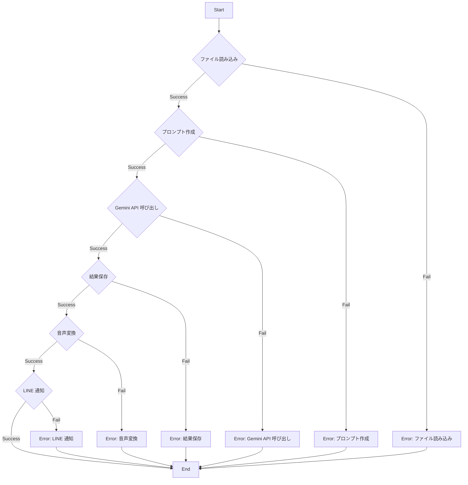

# main.py

## 1. 概略

このPythonスクリプトは、指定されたファイル（デフォルトでは`hoge.csv`）から時系列データを読み込み、そのデータを Gemini API を利用して分析し、分析結果をテキストファイルに保存します。さらに、その分析結果を OpenAI の Text-to-Speech API を使用して音声ファイルに変換し、生成された音声ファイルのURLをLINE Messaging APIを介してブロードキャストします。

スクリプトは以下の主要なステップで構成されます。

1.  **データ取得**: 指定されたファイルから時系列データを読み込みます。
2.  **プロンプト生成**: 取得したデータを Gemini API に渡すためのプロンプトを生成します。
3.  **Gemini API 呼び出し**: 生成されたプロンプトを使用して Gemini API を呼び出し、データの分析結果を取得します。
4.  **結果保存**: Gemini API からの応答をテキストファイルに保存します。
5.  **音声変換**: 分析結果のテキストを OpenAI の Text-to-Speech API を使用して音声ファイルに変換します。
6.  **LINE 通知**: 生成された音声ファイルのURLをLINE Messaging APIを介してブロードキャストします。

## 2. アーキテクチャ図

本ソースコードはyamlやymlファイルを使用していないため、アーキテクチャ図は不要と判断します。

## 3. シーケンス図

本ソースコードはyamlやymlファイルを使用していないため、シーケンス図は不要と判断します。

## 4. フローチャート

## 5. 拡張性

*   **設定ファイルの導入**: API キー、ファイルパス、モデル名などをハードコードするのではなく、設定ファイル（`.env`や`config.yaml`など）から読み込むようにすることで、環境ごとの設定変更が容易になります。
*   **API クライアントの抽象化**: `requests` を直接使用するのではなく、API クライアントのインターフェースを定義し、Gemini API や OpenAI API へのアクセスを抽象化することで、将来的に別の API プロバイダに切り替えることが容易になります。
*   **エラーハンドリングの改善**: 現在のエラーハンドリングは `try-except` ブロックで例外をキャッチしてメッセージを表示するだけですが、ログ出力、リトライ処理、フォールバック処理などを追加することで、より堅牢なシステムにすることができます。
*   **音声合成エンジンの選択**: OpenAI 以外の音声合成エンジン (Google Text-to-Speech など) を利用できるように、音声合成部分を抽象化し、設定によって利用するエンジンを切り替えられるようにすると柔軟性が向上します。
*   **データソースの拡張**: ファイルだけでなく、データベースやAPIからのデータ取得に対応できるようにすることで、様々なデータソースからの分析が可能になります。
*   **LINE通知の柔軟性向上**: LINEへの通知内容（メッセージの種類、送信先）を柔軟に変更できるように、設定項目を増やす、テンプレートエンジンを導入するなどの対応が考えられます。

## 6. 課題

*   **セキュリティ**: API キーやトークンがソースコードにハードコードされているため、セキュリティ上のリスクがあります。環境変数や Secrets Manager などの安全な場所に保存し、スクリプトの実行時に読み込むように変更する必要があります。
*   **可読性**: コードが全体的に冗長で、特にエラーハンドリングの部分が重複しています。関数化やクラス化によってコードを整理し、可読性を向上させる必要があります。
*   **保守性**: 設定値がハードコーディングされているため、変更に時間がかかります。設定ファイルを使用し、設定値を外部化することで、保守性を向上させる必要があります。
*   **エラーハンドリング**: 例外発生時にメッセージを表示するだけで、詳細なログが出力されません。ログ出力ライブラリ (logging など) を使用して、エラーの詳細な情報を記録するように改善する必要があります。
*   **テスト容易性**: 依存性が高く、ユニットテストが困難です。DI (Dependency Injection) を導入し、依存性を分離することで、テスト容易性を向上させる必要があります。
*   **ファイルの場所**: `TARGET_FILE` が絶対パスで指定されているため、環境依存性が高くなっています。相対パスを使用するか、設定ファイルで指定するように変更する必要があります。
*   **ベタ書き**: 処理がmain関数にベタ書きされているため、可読性・保守性が低い。処理を意味ごとに分割して関数化する必要がある。
*   **例外**: 例外発生時のメッセージが日本語で統一されていない。英語で記述するか、国際化対応を行う必要がある。
*   **マジックナンバー**: 180000 という音声の長さを指定する値が、何の根拠に基づいているのか不明。コメントなどで説明を加える必要がある。
*   **printデバッグ**: デバッグのためにprint文が残っている。ロギングに切り替える必要がある。
