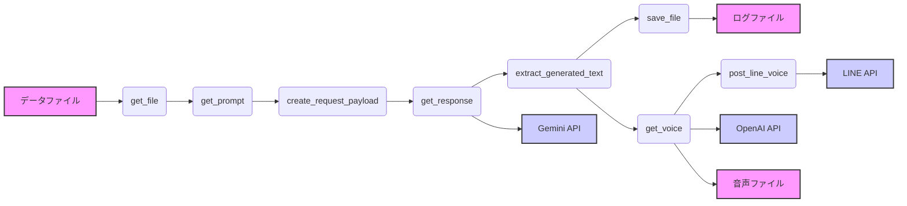
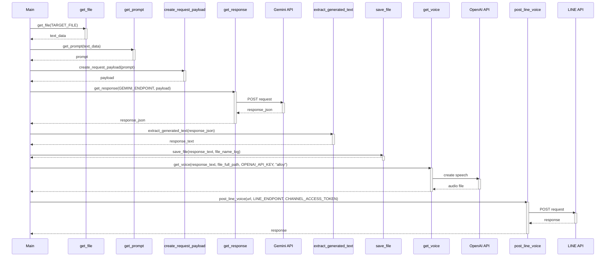
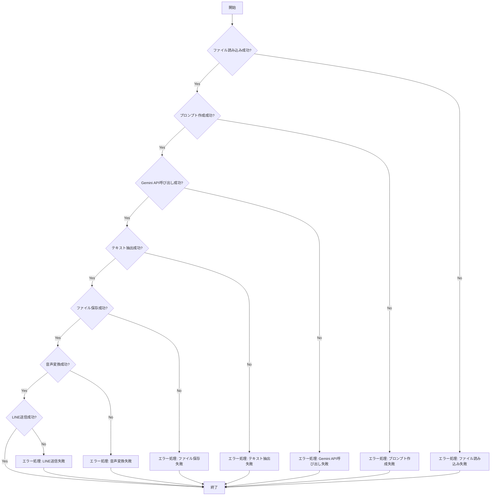

# main.py

## 1. 概略

このPythonスクリプトは、指定された時系列データファイルを読み込み、Geminiモデルを使用してデータの詳細な分析を行います。分析結果はファイルに保存され、OpenAIのテキスト読み上げAPIを使用して音声ファイルに変換されます。最後に、生成された音声ファイルのURLをLINEに送信します。全体として、データ分析、テキスト生成、音声合成、メッセージ送信を自動化するパイプラインとして機能します。

## 2. アーキテクチャ図

## 3. シーケンス図

## 4. フローチャート

## 5. 拡張性

*   **データソースの多様化:** 現在はファイルからの読み込みのみですが、データベース、APIなど、様々なデータソースに対応できるようにインターフェースを抽象化できます。
*   **モデルの切り替え:** Geminiモデルに固定されていますが、設定ファイルや環境変数でモデル名を指定できるようにすることで、他のLLM（Large Language Model）への切り替えを容易にできます。モデル固有の処理を抽象化するインターフェースを設けることも有効です。
*   **音声合成の多様化:** OpenAIの音声合成APIに固定されていますが、別の音声合成サービス（Google Cloud Text-to-Speechなど）に対応できるように、設定ファイルや環境変数で音声合成サービスを指定できるようにすることで、他のTTSへの切り替えを容易にできます。
*   **通知先の拡張:** LINEだけでなく、Slack、Emailなど、他の通知先に対応できるようにインターフェースを抽象化し、設定ファイルで通知先を指定できるようにします。
*   **エラーハンドリングの強化:** 現在は例外発生時にメッセージを表示して終了するだけですが、ログ出力、リトライ処理、アラート通知などの機能を追加することで、より堅牢なシステムにできます。
*   **並列処理の導入:** データ分析処理を非同期化または並列化することで、処理時間を短縮できます。
*   **設定ファイルの導入:** APIキー、ファイルパス、モデル名などをコードに直接記述するのではなく、設定ファイル（JSON、YAMLなど）から読み込むようにすることで、設定変更を容易にできます。

## 6. 課題

*   **APIキーのハードコーディング:** `GEMINI_API_KEY`、`OPENAI_API_KEY`、`CHANNEL_ACCESS_TOKEN`がソースコードに直接記述されているため、セキュリティ上のリスクがあります。環境変数またはセキュアな設定ファイルから読み込むように変更する必要があります。
*   **エラーハンドリングの簡素化:** 例外発生時にエラーメッセージを表示して終了するだけなので、ログ出力やリトライ処理などのより高度なエラーハンドリングを実装する必要があります。
*   **マジックナンバー:** 音声の`duration`が`180000`という数値でハードコーディングされています。この数値の意味を明確にするために、定数として定義し、コメントを追加する必要があります。
*   **ファイルパスのハードコーディング:** `TARGET_FILE`、`LOG_PATH`、`VOICE_PATH`がハードコーディングされています。これらを環境変数または設定ファイルから読み込むように変更する必要があります。また、相対パスではなく絶対パスを使用しているため、柔軟性に欠けます。
*   **可読性の改善:** 関数のコメント（docstring）が不足しているため、各関数の役割や引数、戻り値の説明を追加することで、可読性を向上させることができます。
*   **セキュリティ:** `get_file` でファイルパスを直接使用しているため、ディレクトリトラバーサル攻撃のリスクがあります。ファイルパスのバリデーションを行う必要があります。
*   **LINEの送信:** CHANNEL_ACCESS_TOKENが重複して定義されています。
*   **例外処理:** 例外発生時のメッセージが英語です。日本語で出力するように修正する必要があります。
*   **hoge.csv:** `prompt = get_prompt(get_file("hoge.csv"))`は、デバッグ用でコミットされています。本番環境では`TARGET_FILE`を使用するように戻す必要があります。
